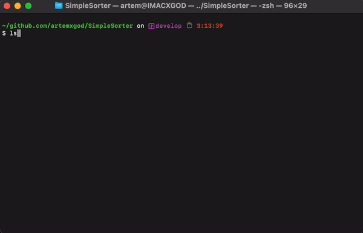

# simple-go-download-sorter

## Introduction
### The download sorter will help you orgonize your downloads
* It creates folders needed for uploaded files
* Arranges files in created folders by their extention

## Example

